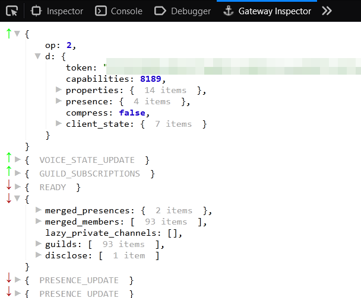

# discord-gateway-inspector
View Discord gateway messages in your browser

## Usage:

1. Download or clone the repo
2. Go to `about:debugging#/runtime/this-firefox`
3. Click "Load Temporary Add-on..."
4. Find and open `manifest.json`
5. Configure the extension as "always allow" so you don't have to manually start it
6. Open devtools and use the Gateway Inspector

### Notes:

Incoming messages are intercepted by latching on to the Discord socket's internal `dispatch` event,
so op codes HELLO, RECONNECT, INVALID_SESSION, HEARTBEAT, and HEARTBEAT_ACK will not appear. 
Outgoing messages are intercepted by detouring the internal WebSocket's `send` function, so all
outgoing messages will appear.

The content script responsbile for doing the hooking is always run regardless of whether or not
devtools are open. If this bothers you then disable the extension if you aren't using it.

Sorry for the not-so-nice UI. I don't like frontend 😼
